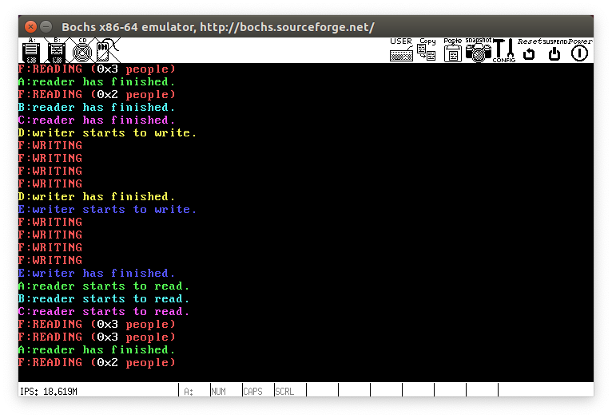
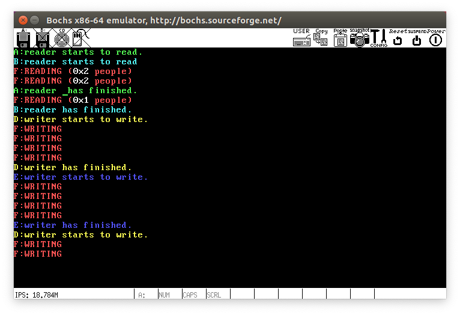

# README

在Orange's实现源码chapter6 r基础上修改而成，在 ubuntu 36 位下运行

### 修改内容

1. Makefile：

   添加 run 指令直接运行

   CFLAGS后添加 `-fno-stack-protector` 避免 `__stack_chk_fail` 报错

   CC后添加 `-w` 忽略 gcc 编译 warning 警告

2. proc.h

   1. 定义信号量结构体 semaphore

      ```c
      typedef struct semaphore{
      	int value;//信号量值
      	PROCESS *list[20];//等待队列
      }SEMAPHORE;
      ```

   2. 结构体 s_proc 中添加数据sleep_tick 和 blocked用于控制睡眠

   3. 为 TestD()，TestE()，TestF() 添加相关代码

   4. 添加 ifndef 避免重定义

3. const.h

   1. 共定义了 6 个系统调用，修改 NR_SYS_CALL为 6

4. proto.h

   1. 添加对 proc.h 的引用
   2. 添加 main.c， proc.c，syscall.asm 新定义的方法调用

5. global.c

   1. 为TestD()，TestE()，TestF() 添加相关代码
   2. sys_call_table 中添加 sys_sleep, sys_my_disp, sys_P, sys_V, sys_my_disp_int

6. syscall.asm

   1. 增加 sleep，my_disp， P, V, my_disp_int
   2. 增加 my_disp 方法实现颜色输出

7. kernal.asm

   1. 把传入参数压栈

8. proc.c

   1. 修改 schedule() 方法
   2. 添加 sys_sleep()
   3. 添加 sys_my_disp() 方法实现彩色打印
   4. 添加 sys_P()方法
   5. 添加 sys_V()方法
   6. 添加 sys_my_disp_int() 方法实现打印数字

9. main.c 主要功能实现

  1. 进行待用数据定义
  2. 在 kernel_main() 进行了各项数据的初始化
  3. TestA(),TestB(),TestC()为读者进程，TestD(),TestE()为写者进程，都写了两个分别为读者优先和写者优先，运行时注释掉一个，TestF 为普通进程实现

### 运行截图

1. 读者优先，最多 3 个读者同时读

   

2. 写者优先，最多 2 个读者同时读

   

   